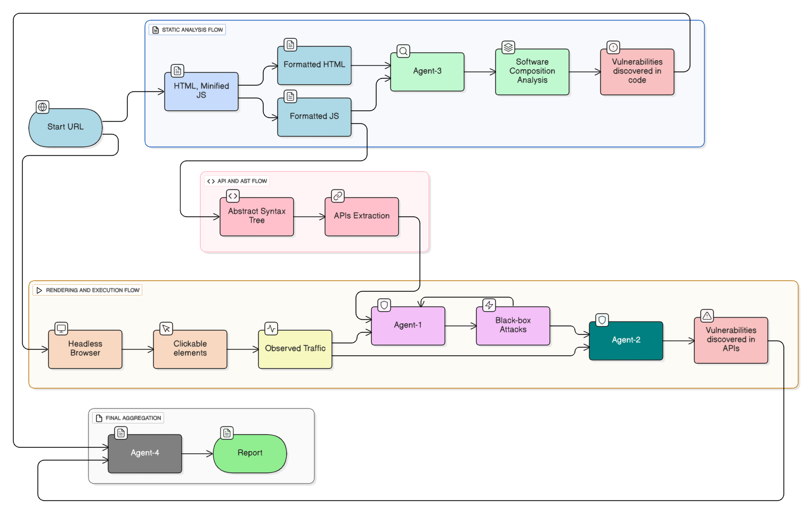

# Architecture

# Pre-requisites

* Add service_account.json to the root directory of the project. This file should contain the credentials for accessing the Google Sheets API. If you don't need this functionality, you can remove respective code.
* Add Azure OpenAI environment variables to you system before running the application. These variables include:
  * AZURE_OPENAI_API_KEY: The API key for authenticating with your Azure OpenAI service.
  * AZURE_OPENAI_API_VERSION: The API version for your Azure OpenAI service.
  * AZURE_OPENAI_ENDPOINT: The endpoint URL for your Azure OpenAI service.
